Untitled
================

# Importación de las librerías

``` r
suppressWarnings(suppressPackageStartupMessages(library(foreign)))
suppressWarnings(suppressPackageStartupMessages(library(funModeling)))
suppressWarnings(suppressPackageStartupMessages(library(mice)))
suppressWarnings(suppressPackageStartupMessages(library(DataExplorer)))
suppressWarnings(suppressPackageStartupMessages(library(ggplot2)))
suppressWarnings(suppressPackageStartupMessages(library(corrplot)))
suppressWarnings(suppressPackageStartupMessages(library(caret)))
suppressWarnings(suppressPackageStartupMessages(library(sampling)))
suppressWarnings(suppressPackageStartupMessages(library(dplyr)))
suppressWarnings(suppressPackageStartupMessages(library(doParallel)))
```

# Lectura del archivo de datos

``` r
data.quiz <- as.data.frame(read.spss("48211123-datos.sav"))
```

    ## re-encoding from UTF-8

``` r
# Primeros registros.
head(data.quiz)
```

    ##   edad   marital direcc ingres       ingcat coche  cochecat
    ## 1   55    Casado     12     72    $50 - $74  36.2      Lujo
    ## 2   56 Sin casar     29    153         $75+  76.9      Lujo
    ## 3   28    Casado      9     28    $25 - $49  13.7 Económico
    ## 4   24    Casado      4     26    $25 - $49  12.5 Económico
    ## 5   25 Sin casar      2     23 Menos de $25  11.3 Económico
    ## 6   45    Casado      9     76         $75+  37.2      Lujo
    ##                          educ empleo retirado     empcat            satlab
    ## 1 No completó el bachillerato     23       No  Más de 15    Muy satisfecho
    ## 2 No completó el bachillerato     35       No  Más de 15   Algo satisfecho
    ## 3    Universitarios parciales      4       No Menos de 5            Neutro
    ## 4              Universitarios      0       No Menos de 5  Muy insatisfecho
    ## 5                Bachillerato      5       No     5 a 15 Algo insatisfecho
    ## 6    Universitarios parciales     13       No     5 a 15 Algo insatisfecho
    ##   genero residen inalam multline voz busca internet idllam espera tv video cd
    ## 1  Mujer       4     Sí       Sí  No    Sí       Sí     Sí     Sí No    No No
    ## 2 Hombre       1     No       Sí  No    No       Sí     No     No No    No No
    ## 3  Mujer       3     No       Sí  No    Sí       Sí     No     No No    No No
    ## 4 Hombre       3     No       No  No    Sí       Sí     Sí     No No    No No
    ## 5 Hombre       2     Sí       Sí  Sí    Sí       Sí     No     Sí No    No No
    ## 6 Hombre       2     Sí       No  No    No       Sí     Sí     Sí No    No No
    ##   pda pc fax noticias respuest
    ## 1  Sí Sí  Sí       Sí       No
    ## 2  Sí Sí  Sí       Sí       Sí
    ## 3  No No  Sí       No       No
    ## 4  No No  No       No       No
    ## 5  Sí Sí  Sí       No       No
    ## 6  Sí No  Sí       Sí       No

``` r
# Estructura.
str(data.quiz)
```

    ## 'data.frame':    6400 obs. of  29 variables:
    ##  $ edad    : num  55 56 28 24 25 45 42 35 46 34 ...
    ##  $ marital : Factor w/ 2 levels "Sin casar","Casado": 2 1 2 2 1 2 1 1 1 2 ...
    ##  $ direcc  : num  12 29 9 4 2 9 19 15 26 0 ...
    ##  $ ingres  : num  72 153 28 26 23 76 40 57 24 89 ...
    ##  $ ingcat  : Factor w/ 4 levels "Menos de $25",..: 3 4 2 2 1 4 2 3 1 4 ...
    ##  $ coche   : num  36.2 76.9 13.7 12.5 11.3 37.2 19.8 28.2 12.2 46.1 ...
    ##  $ cochecat: Factor w/ 3 levels "Económico","Estándar",..: 3 3 1 1 1 3 2 2 1 3 ...
    ##  $ educ    : Factor w/ 5 levels "No completó el bachillerato",..: 1 1 3 4 2 3 3 2 1 3 ...
    ##  $ empleo  : num  23 35 4 0 5 13 10 1 11 12 ...
    ##  $ retirado: Factor w/ 2 levels "No","Sí": 1 1 1 1 1 1 1 1 1 1 ...
    ##  $ empcat  : Factor w/ 3 levels "Menos de 5","5 a 15",..: 3 3 1 1 2 2 2 1 2 2 ...
    ##  $ satlab  : Factor w/ 5 levels "Muy insatisfecho",..: 5 4 3 1 2 2 2 1 5 4 ...
    ##  $ genero  : Factor w/ 2 levels "Hombre","Mujer": 2 1 2 1 1 1 1 2 2 1 ...
    ##  $ residen : num  4 1 3 3 2 2 1 1 2 6 ...
    ##  $ inalam  : Factor w/ 2 levels "Sí","No": 1 2 2 2 1 1 2 1 1 2 ...
    ##  $ multline: Factor w/ 2 levels "Sí","No": 1 1 1 2 1 2 2 1 1 1 ...
    ##  $ voz     : Factor w/ 2 levels "Sí","No": 2 2 2 2 1 2 2 1 2 2 ...
    ##  $ busca   : Factor w/ 2 levels "Sí","No": 1 2 1 1 1 2 1 1 1 1 ...
    ##  $ internet: Factor w/ 4 levels "Sí","No","No sabe",..: 1 1 1 1 1 1 2 1 1 1 ...
    ##  $ idllam  : Factor w/ 2 levels "Sí","No": 1 2 2 1 2 1 2 1 2 2 ...
    ##  $ espera  : Factor w/ 2 levels "Sí","No": 1 2 2 2 1 1 1 1 1 2 ...
    ##  $ tv      : Factor w/ 2 levels "Sí","No": 2 2 2 2 2 2 2 2 2 2 ...
    ##  $ video   : Factor w/ 2 levels "Sí","No": 2 2 2 2 2 2 2 2 2 2 ...
    ##  $ cd      : Factor w/ 2 levels "Sí","No": 2 2 2 2 2 2 2 2 2 2 ...
    ##  $ pda     : Factor w/ 2 levels "Sí","No": 1 1 2 2 1 1 1 1 1 1 ...
    ##  $ pc      : Factor w/ 2 levels "Sí","No": 1 1 2 2 1 2 1 2 1 1 ...
    ##  $ fax     : Factor w/ 2 levels "Sí","No": 1 1 1 2 1 1 1 1 1 2 ...
    ##  $ noticias: Factor w/ 2 levels "Sí","No": 1 1 2 2 2 1 1 1 2 2 ...
    ##  $ respuest: Factor w/ 2 levels "Sí","No": 2 1 2 2 2 2 2 2 2 1 ...

``` r
# Dimensión.
dim(data.quiz)
```

    ## [1] 6400   29

# Datos NAs

``` r
md.pattern(data.quiz, rotate.names = TRUE)
```

    ##  /\     /\
    ## {  `---'  }
    ## {  O   O  }
    ## ==>  V <==  No need for mice. This data set is completely observed.
    ##  \  \|/  /
    ##   `-----'

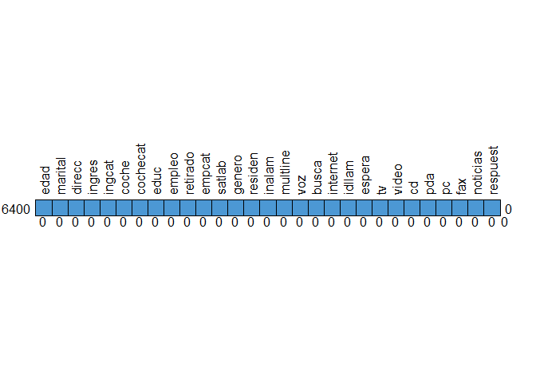<!-- -->

    ##      edad marital direcc ingres ingcat coche cochecat educ empleo retirado
    ## 6400    1       1      1      1      1     1        1    1      1        1
    ##         0       0      0      0      0     0        0    0      0        0
    ##      empcat satlab genero residen inalam multline voz busca internet idllam
    ## 6400      1      1      1       1      1        1   1     1        1      1
    ##           0      0      0       0      0        0   0     0        0      0
    ##      espera tv video cd pda pc fax noticias respuest  
    ## 6400      1  1     1  1   1  1   1        1        1 0
    ##           0  0     0  0   0  0   0        0        0 0

``` r
plot_missing(data.quiz)
```

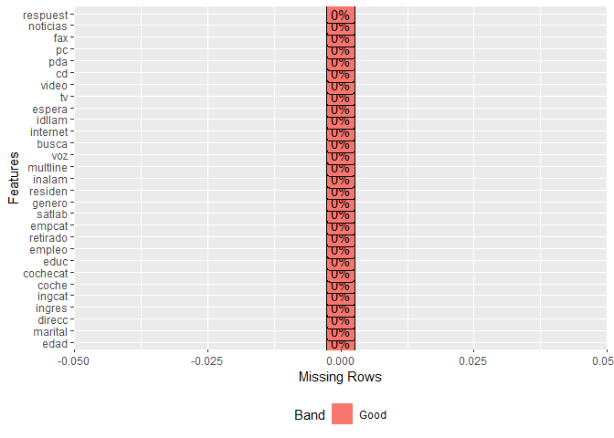<!-- -->

Comentario//: Este dataset no contiene ningún valor nulo.

# Análisis Exploratorio de los datos

``` r
summary(data.quiz)
```

    ##       edad            marital         direcc          ingres       
    ##  Min.   :18.00   Sin casar:3224   Min.   : 0.00   Min.   :   9.00  
    ##  1st Qu.:33.00   Casado   :3176   1st Qu.: 3.00   1st Qu.:  28.00  
    ##  Median :41.00                    Median : 9.00   Median :  45.00  
    ##  Mean   :42.06                    Mean   :11.56   Mean   :  69.47  
    ##  3rd Qu.:51.00                    3rd Qu.:17.00   3rd Qu.:  79.00  
    ##  Max.   :77.00                    Max.   :56.00   Max.   :1116.00  
    ##           ingcat         coche            cochecat   
    ##  Menos de $25:1174   Min.   : 4.20   Económico:1841  
    ##  $25 - $49   :2388   1st Qu.:13.90   Estándar :2275  
    ##  $50 - $74   :1120   Median :22.20   Lujo     :2284  
    ##  $75+        :1718   Mean   :30.13                   
    ##                      3rd Qu.:39.50                   
    ##                      Max.   :99.90                   
    ##                           educ          empleo      retirado         empcat    
    ##  No completó el bachillerato:1390   Min.   : 0.00   No:6092   Menos de 5:2216  
    ##  Bachillerato               :1936   1st Qu.: 3.00   Sí: 308   5 a 15    :2364  
    ##  Universitarios parciales   :1360   Median : 8.00             Más de 15 :1820  
    ##  Universitarios             :1355   Mean   :10.57                              
    ##  Post-universitarios        : 359   3rd Qu.:16.00                              
    ##                                     Max.   :57.00                              
    ##                satlab        genero        residen     inalam    multline 
    ##  Muy insatisfecho :1109   Hombre:3221   Min.   :1.00   Sí:3853   Sí:3709  
    ##  Algo insatisfecho:1268   Mujer :3179   1st Qu.:1.00   No:2547   No:2691  
    ##  Neutro           :1393                 Median :2.00                      
    ##  Algo satisfecho  :1406                 Mean   :2.35                      
    ##  Muy satisfecho   :1224                 3rd Qu.:3.00                      
    ##                                         Max.   :9.00                      
    ##  voz       busca            internet    idllam    espera     tv       video    
    ##  Sí:3645   Sí:4819   Sí         :4509   Sí:3133   Sí:3153   Sí:  63   Sí: 255  
    ##  No:2755   No:1581   No         :1636   No:3267   No:3247   No:6337   No:6145  
    ##                      No sabe    : 116                                          
    ##                      No contesta: 139                                          
    ##                                                                                
    ##                                                                                
    ##   cd       pda        pc       fax       noticias  respuest 
    ##  Sí: 194   Sí:5093   Sí:3589   Sí:5198   Sí:2768   Sí: 679  
    ##  No:6206   No:1307   No:2811   No:1202   No:3632   No:5721  
    ##                                                             
    ##                                                             
    ##                                                             
    ## 

``` r
status(data.quiz)
```

    ##          variable q_zeros   p_zeros q_na p_na q_inf p_inf    type unique
    ## edad         edad       0 0.0000000    0    0     0     0 numeric     60
    ## marital   marital       0 0.0000000    0    0     0     0  factor      2
    ## direcc     direcc     474 0.0740625    0    0     0     0 numeric     55
    ## ingres     ingres       0 0.0000000    0    0     0     0 numeric    386
    ## ingcat     ingcat       0 0.0000000    0    0     0     0  factor      4
    ## coche       coche       0 0.0000000    0    0     0     0 numeric    919
    ## cochecat cochecat       0 0.0000000    0    0     0     0  factor      3
    ## educ         educ       0 0.0000000    0    0     0     0  factor      5
    ## empleo     empleo     680 0.1062500    0    0     0     0 numeric     53
    ## retirado retirado       0 0.0000000    0    0     0     0  factor      2
    ## empcat     empcat       0 0.0000000    0    0     0     0  factor      3
    ## satlab     satlab       0 0.0000000    0    0     0     0  factor      5
    ## genero     genero       0 0.0000000    0    0     0     0  factor      2
    ## residen   residen       0 0.0000000    0    0     0     0 numeric      9
    ## inalam     inalam       0 0.0000000    0    0     0     0  factor      2
    ## multline multline       0 0.0000000    0    0     0     0  factor      2
    ## voz           voz       0 0.0000000    0    0     0     0  factor      2
    ## busca       busca       0 0.0000000    0    0     0     0  factor      2
    ## internet internet       0 0.0000000    0    0     0     0  factor      4
    ## idllam     idllam       0 0.0000000    0    0     0     0  factor      2
    ## espera     espera       0 0.0000000    0    0     0     0  factor      2
    ## tv             tv       0 0.0000000    0    0     0     0  factor      2
    ## video       video       0 0.0000000    0    0     0     0  factor      2
    ## cd             cd       0 0.0000000    0    0     0     0  factor      2
    ## pda           pda       0 0.0000000    0    0     0     0  factor      2
    ## pc             pc       0 0.0000000    0    0     0     0  factor      2
    ## fax           fax       0 0.0000000    0    0     0     0  factor      2
    ## noticias noticias       0 0.0000000    0    0     0     0  factor      2
    ## respuest respuest       0 0.0000000    0    0     0     0  factor      2

``` r
profiling_num(data.quiz)
```

    ##   variable      mean   std_dev variation_coef p_01 p_05 p_25 p_50 p_75  p_95
    ## 1     edad 42.058594 12.289516      0.2921999 20.0 24.0 33.0 41.0 51.0  64.0
    ## 2   direcc 11.559844  9.938136      0.8597119  0.0  0.0  3.0  9.0 17.0  31.0
    ## 3   ingres 69.474844 78.718564      1.1330513 11.0 17.0 28.0 45.0 79.0 205.0
    ## 4    coche 30.128375 21.926917      0.7277829  5.2  8.4 13.9 22.2 39.5  77.3
    ## 5   empleo 10.566250  9.724458      0.9203320  0.0  0.0  3.0  8.0 16.0  31.0
    ## 6  residen  2.349687  1.468287      0.6248863  1.0  1.0  1.0  2.0  3.0   5.0
    ##      p_99  skewness  kurtosis  iqr               range_98   range_80
    ## 1  71.000 0.2990570  2.397496 18.0               [20, 71]   [26, 59]
    ## 2  41.000 1.0404439  3.673472 14.0                [0, 41]    [1, 26]
    ## 3 385.080 4.5116965 36.849267 51.0 [11, 385.080000000002]  [20, 143]
    ## 4  92.301 1.2158673  3.522255 25.6          [5.2, 92.301] [10, 69.1]
    ## 5  39.000 1.1006493  3.732148 13.0                [0, 39]    [0, 25]
    ## 6   6.000 0.9942762  3.252195  2.0                 [1, 6]     [1, 5]

# Análisis de Correlación entre variables continuas

``` r
# Variables numéricas.
var.num <- data.quiz[, c(1,3,4,6,9,14)]
# Matriz de correlación.
corr.quiz <- as.matrix(round(cor(var.num),2))
corr.quiz
```

    ##          edad direcc ingres coche empleo residen
    ## edad     1.00   0.61   0.34  0.38   0.62   -0.24
    ## direcc   0.61   1.00   0.22  0.24   0.37   -0.16
    ## ingres   0.34   0.22   1.00  0.79   0.58   -0.07
    ## coche    0.38   0.24   0.79  1.00   0.64   -0.09
    ## empleo   0.62   0.37   0.58  0.64   1.00   -0.15
    ## residen -0.24  -0.16  -0.07 -0.09  -0.15    1.00

``` r
# Visualizar la matriz de correlación.
corrplot(cor(var.num),
         type = "upper", 
         method = "circle", 
         tl.col = "black",
         title = "Correlaciones entre variables",
         pch.cex = 2,
         tl.cex = .8)
```

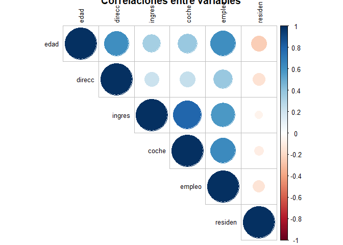<!-- -->

``` r
# Descartar las variables explicativas que estén altamente correlacionadas.
findCorrelation(corr.quiz, cutoff = .7, verbose = TRUE, names = TRUE)
```

    ## Compare row 4  and column  3 with corr  0.79 
    ##   Means:  0.428 vs 0.36 so flagging column 4 
    ## All correlations <= 0.7

    ## [1] "coche"

Comentarios//: La variable “coche” está altamente correlacionada con los
ingresos del hogar. Por tanto, la variable “coche” se descarta del
análisis.

``` r
# Dataframe sin la variable "coche".
datamodified.quiz <- data.quiz[,-6]
head(datamodified.quiz)
```

    ##   edad   marital direcc ingres       ingcat  cochecat
    ## 1   55    Casado     12     72    $50 - $74      Lujo
    ## 2   56 Sin casar     29    153         $75+      Lujo
    ## 3   28    Casado      9     28    $25 - $49 Económico
    ## 4   24    Casado      4     26    $25 - $49 Económico
    ## 5   25 Sin casar      2     23 Menos de $25 Económico
    ## 6   45    Casado      9     76         $75+      Lujo
    ##                          educ empleo retirado     empcat            satlab
    ## 1 No completó el bachillerato     23       No  Más de 15    Muy satisfecho
    ## 2 No completó el bachillerato     35       No  Más de 15   Algo satisfecho
    ## 3    Universitarios parciales      4       No Menos de 5            Neutro
    ## 4              Universitarios      0       No Menos de 5  Muy insatisfecho
    ## 5                Bachillerato      5       No     5 a 15 Algo insatisfecho
    ## 6    Universitarios parciales     13       No     5 a 15 Algo insatisfecho
    ##   genero residen inalam multline voz busca internet idllam espera tv video cd
    ## 1  Mujer       4     Sí       Sí  No    Sí       Sí     Sí     Sí No    No No
    ## 2 Hombre       1     No       Sí  No    No       Sí     No     No No    No No
    ## 3  Mujer       3     No       Sí  No    Sí       Sí     No     No No    No No
    ## 4 Hombre       3     No       No  No    Sí       Sí     Sí     No No    No No
    ## 5 Hombre       2     Sí       Sí  Sí    Sí       Sí     No     Sí No    No No
    ## 6 Hombre       2     Sí       No  No    No       Sí     Sí     Sí No    No No
    ##   pda pc fax noticias respuest
    ## 1  Sí Sí  Sí       Sí       No
    ## 2  Sí Sí  Sí       Sí       Sí
    ## 3  No No  Sí       No       No
    ## 4  No No  No       No       No
    ## 5  Sí Sí  Sí       No       No
    ## 6  Sí No  Sí       Sí       No

# Análisis de la Variable Objetivo

``` r
ggplot(datamodified.quiz, aes(x = respuest)) +
  geom_bar(colour = "black", fill = "darkblue")
```

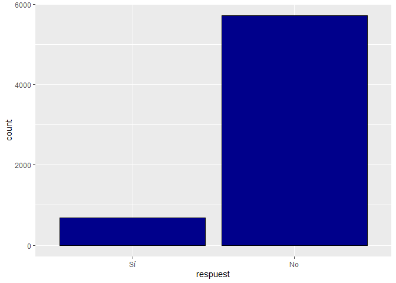<!-- -->

``` r
table(data.quiz$respuest)
```

    ## 
    ##   Sí   No 
    ##  679 5721

Comentarios//: La variable “respuest” está desbalanceada, es decir, hay
significativamente mayor número de clientes que no respondieron las
ofertas mensuales enviadas que los que sí la respondieron. Por tanto,
dicha variable hay que balancearla mediante el Método del Cubo, el cual
se submuestrea la clase mayoritaria.

# Balanceado de la Muestra

``` r
# Dataframe que contiene la población de datos de la clase mayoritaria (respuest == "No").
no.respuest <- subset(datamodified.quiz, respuest == "No")
head(no.respuest)
```

    ##   edad   marital direcc ingres       ingcat  cochecat
    ## 1   55    Casado     12     72    $50 - $74      Lujo
    ## 3   28    Casado      9     28    $25 - $49 Económico
    ## 4   24    Casado      4     26    $25 - $49 Económico
    ## 5   25 Sin casar      2     23 Menos de $25 Económico
    ## 6   45    Casado      9     76         $75+      Lujo
    ## 7   42 Sin casar     19     40    $25 - $49  Estándar
    ##                          educ empleo retirado     empcat            satlab
    ## 1 No completó el bachillerato     23       No  Más de 15    Muy satisfecho
    ## 3    Universitarios parciales      4       No Menos de 5            Neutro
    ## 4              Universitarios      0       No Menos de 5  Muy insatisfecho
    ## 5                Bachillerato      5       No     5 a 15 Algo insatisfecho
    ## 6    Universitarios parciales     13       No     5 a 15 Algo insatisfecho
    ## 7    Universitarios parciales     10       No     5 a 15 Algo insatisfecho
    ##   genero residen inalam multline voz busca internet idllam espera tv video cd
    ## 1  Mujer       4     Sí       Sí  No    Sí       Sí     Sí     Sí No    No No
    ## 3  Mujer       3     No       Sí  No    Sí       Sí     No     No No    No No
    ## 4 Hombre       3     No       No  No    Sí       Sí     Sí     No No    No No
    ## 5 Hombre       2     Sí       Sí  Sí    Sí       Sí     No     Sí No    No No
    ## 6 Hombre       2     Sí       No  No    No       Sí     Sí     Sí No    No No
    ## 7 Hombre       1     No       No  No    Sí       No     No     Sí No    No No
    ##   pda pc fax noticias respuest
    ## 1  Sí Sí  Sí       Sí       No
    ## 3  No No  Sí       No       No
    ## 4  No No  No       No       No
    ## 5  Sí Sí  Sí       No       No
    ## 6  Sí No  Sí       Sí       No
    ## 7  Sí Sí  Sí       Sí       No

``` r
# Crear las variables indicadoras para cada una de las variables de equilibrio.
X1 <- no.respuest$edad
colnames(X1) <- levels(no.respuest$edad)

X2 <- disjunctive(no.respuest$marital)
colnames(X2) <- levels(no.respuest$marital)

X3 <- no.respuest$direcc
colnames(X3) <- levels(no.respuest$direcc)

X4 <- no.respuest$ingres
colnames(X4) <- levels(no.respuest$ingres)

X5 <- disjunctive(no.respuest$ingcat)
colnames(X5) <- levels(no.respuest$ingcat)

X6 <- disjunctive(no.respuest$cochecat)
colnames(X6) <- levels(no.respuest$cochecat)

X7 <- disjunctive(no.respuest$educ)
colnames(X7) <- levels(no.respuest$educ)

X8 <- no.respuest$empleo
colnames(X8) <- levels(no.respuest$empleo)

X9 <- disjunctive(no.respuest$retirado)
colnames(X9) <- levels(no.respuest$retirado)

X10 <- disjunctive(no.respuest$empcat)
colnames(X10) <- levels(no.respuest$empcat)

X11 <- disjunctive(no.respuest$satlab)
colnames(X11) <- levels(no.respuest$satlab)

X12 <- disjunctive(no.respuest$genero)
colnames(X12) <- levels(no.respuest$genero)

X13 <- no.respuest$residen
colnames(X13) <- levels(no.respuest$residen)

X14 <- disjunctive(no.respuest$inalam)
colnames(X14) <- levels(no.respuest$inalam)

X15 <- disjunctive(no.respuest$multline)
colnames(X15) <- levels(no.respuest$multline)

X16 <- disjunctive(no.respuest$voz)
colnames(X16) <- levels(no.respuest$voz)

X17 <- disjunctive(no.respuest$busca)
colnames(X17) <- levels(no.respuest$busca)

X18 <- disjunctive(no.respuest$internet)
colnames(X18) <- levels(no.respuest$internet)

X19 <- disjunctive(no.respuest$idllam)
colnames(X19) <- levels(no.respuest$idllam)

X20 <- disjunctive(no.respuest$espera)
colnames(X20) <- levels(no.respuest$espera)

X21 <- disjunctive(no.respuest$tv)
colnames(X21) <- levels(no.respuest$tv)

X22 <- disjunctive(no.respuest$video)
colnames(X22) <- levels(no.respuest$video)

X23 <- disjunctive(no.respuest$cd)
colnames(X23) <- levels(no.respuest$cd)

X24 <- disjunctive(no.respuest$pda)
colnames(X24) <- levels(no.respuest$pda)

X25 <- disjunctive(no.respuest$pc)
colnames(X25) <- levels(no.respuest$pc)

X26 <- disjunctive(no.respuest$fax)
colnames(X26) <- levels(no.respuest$fax)

X27 <- disjunctive(no.respuest$noticias)
colnames(X27) <- levels(no.respuest$noticias)
```

``` r
# Definir la variable UNO.
UNO <- rep(1, dim(no.respuest)[1])
```

``` r
# Contruir la matriz de equilibrio, a partir de todas las variables auxiliares + UNO.
X.matrix <- cbind(UNO, X1, X2, X3, X4, X5, X6, X7, X8, X9, X10, 
                  X11, X12, X13, X14, X15, X16, X17, X18, X19, 
                  X20, X21, X22, X23, X24, X25, X26, X27)
```

``` r
## Calcular las probabilidades de inclusión.
nSI <- 679
nNO <- nrow(no.respuest)
pik <- rep(nSI/nNO, nNO)
```

``` r
# Seleccionar la muestra representativa.
s <-  samplecube(X.matrix, pik, order = 1, comment = FALSE, method = 2)
```

``` r
# Definir la muestra seleccionada por el método del Cubo.
no.muestra <- cbind(no.respuest, s)
no.muestra <- subset(no.muestra, s == 1)
no.muestra$s <- NULL

# Dataframe final, tras el método del Cubo.
si.respuest <- subset(datamodified.quiz, respuest == "Sí")
datafinal.quiz <- rbind(no.muestra, si.respuest)
head(datafinal.quiz)
```

    ##    edad   marital direcc ingres    ingcat  cochecat                        educ
    ## 6    45    Casado      9     76      $75+      Lujo    Universitarios parciales
    ## 13   31    Casado      9     40 $25 - $49  Estándar              Universitarios
    ## 18   32 Sin casar      0     28 $25 - $49 Económico No completó el bachillerato
    ## 29   52 Sin casar     20    272      $75+      Lujo No completó el bachillerato
    ## 34   25    Casado      0     58 $50 - $74  Estándar    Universitarios parciales
    ## 43   32 Sin casar      2     32 $25 - $49  Estándar                Bachillerato
    ##    empleo retirado     empcat            satlab genero residen inalam multline
    ## 6      13       No     5 a 15 Algo insatisfecho Hombre       2     Sí       No
    ## 13      0       No Menos de 5 Algo insatisfecho  Mujer       4     Sí       Sí
    ## 18      2       No Menos de 5   Algo satisfecho  Mujer       2     Sí       Sí
    ## 29     35       No  Más de 15    Muy satisfecho Hombre       1     No       No
    ## 34      4       No Menos de 5 Algo insatisfecho  Mujer       5     No       No
    ## 43     10       No     5 a 15    Muy satisfecho Hombre       6     Sí       Sí
    ##    voz busca internet idllam espera tv video cd pda pc fax noticias respuest
    ## 6   No    No       Sí     Sí     Sí No    No No  Sí No  Sí       Sí       No
    ## 13  Sí    Sí       Sí     Sí     Sí No    No Sí  Sí Sí  Sí       No       No
    ## 18  Sí    Sí       Sí     No     No No    No No  No Sí  No       No       No
    ## 29  No    Sí       Sí     No     Sí No    No No  Sí Sí  Sí       Sí       No
    ## 34  No    Sí       Sí     No     No No    No No  No No  Sí       No       No
    ## 43  Sí    Sí       Sí     No     No No    No No  Sí Sí  Sí       No       No

``` r
# Comprobar que la variable "respuest" está balanceada.
table(datafinal.quiz$respuest)
```

    ## 
    ##  Sí  No 
    ## 679 679

``` r
ggplot(datafinal.quiz, aes(x = respuest)) +
  geom_bar(colour = "black", fill = "darkblue")
```

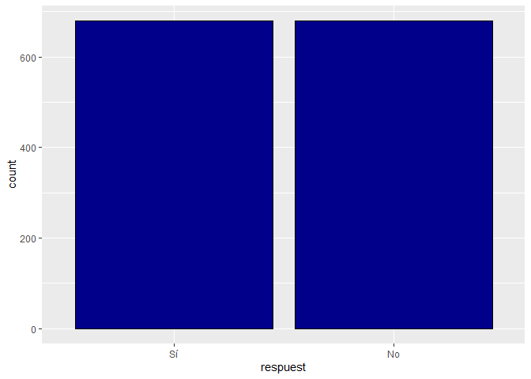<!-- -->

``` r
# Dimensión final del dataset.
dim(datafinal.quiz)
```

    ## [1] 1358   28

Comentario//: La dimensión final del dataset es de 1.358 registros, 27
variables explicativas y 1 variable a explicar.

# Análisis Gráfico

## Variables Explicativas Cualitativas

``` r
ggplot(datafinal.quiz, aes(x = genero)) +
  geom_bar(colour = "black", fill = "grey") + 
  facet_grid(respuest~.) + 
  ggtitle("Nº clientes que respondieron o no a las ofertas, según su género")
```

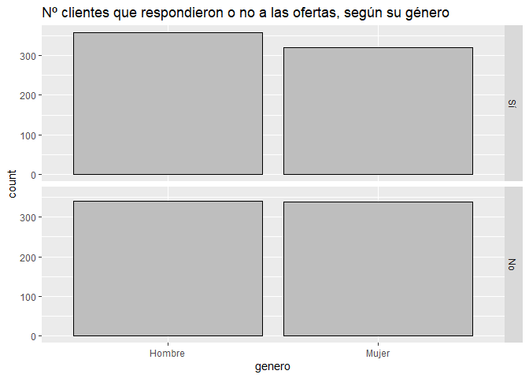<!-- -->

``` r
ggplot(datafinal.quiz, aes(x = marital)) +
  geom_bar(colour = "black", fill = "lightblue") + 
  facet_grid(respuest~.) + 
  ggtitle("Nº clientes que respondieron o no a las ofertas, según su estado civil")
```

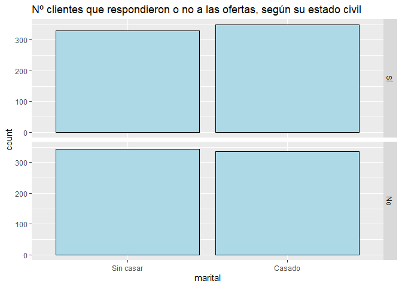<!-- -->

``` r
ggplot(datafinal.quiz, aes(x = ingcat)) +
  geom_bar(colour = "black", fill = "red") + 
  facet_grid(respuest~.) + 
  ggtitle("Nº clientes que respondieron o no a las ofertas, según su categoría de ingresos")
```

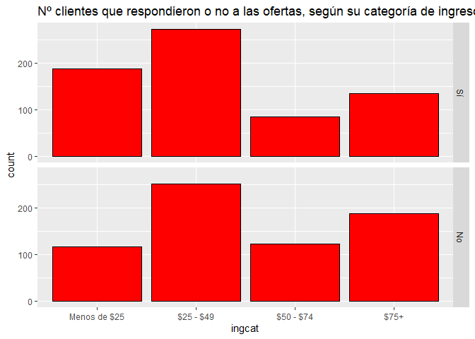<!-- -->

``` r
ggplot(datafinal.quiz, aes(x = cochecat)) +
  geom_bar(colour = "black", fill = "pink") + 
  facet_grid(respuest~.) + 
  ggtitle("Nº clientes que respondieron o no a las ofertas, según su categoría del coche")
```

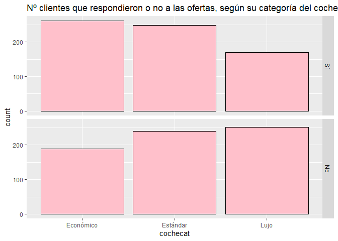<!-- -->

``` r
ggplot(datafinal.quiz, aes(x = educ)) +
  geom_bar(colour = "black", fill = "yellow") + 
  facet_grid(respuest~.) + 
  ggtitle("Nº clientes que respondieron o no a las ofertas, según su nivel educativo")
```

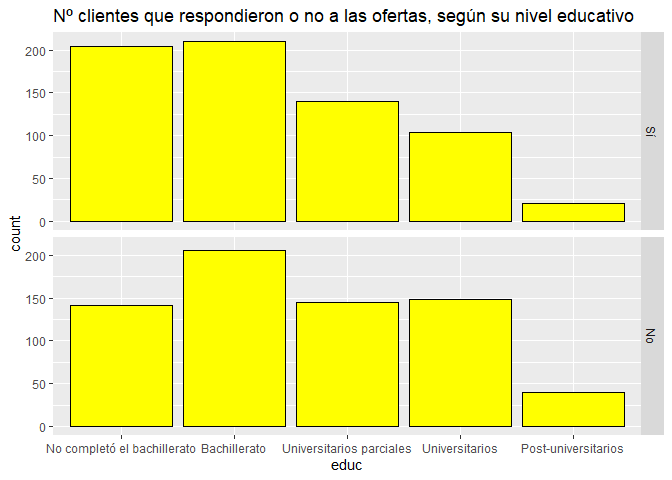<!-- -->

``` r
ggplot(datafinal.quiz, aes(x = retirado)) +
  geom_bar(colour = "black", fill = "green") + 
  facet_grid(respuest~.) + 
  ggtitle("Nº clientes que respondieron o no a las ofertas, según esté retirado")
```

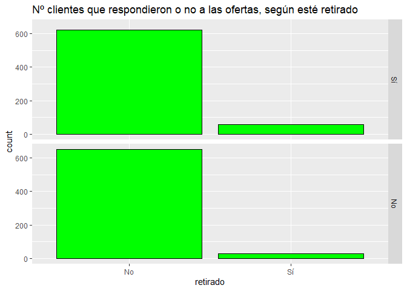<!-- -->

``` r
ggplot(datafinal.quiz, aes(x = empcat)) +
  geom_bar(colour = "black", fill = "brown") + 
  facet_grid(respuest~.) + 
  ggtitle("Nº clientes que respondieron o no a las ofertas, según los años en la empresa")
```

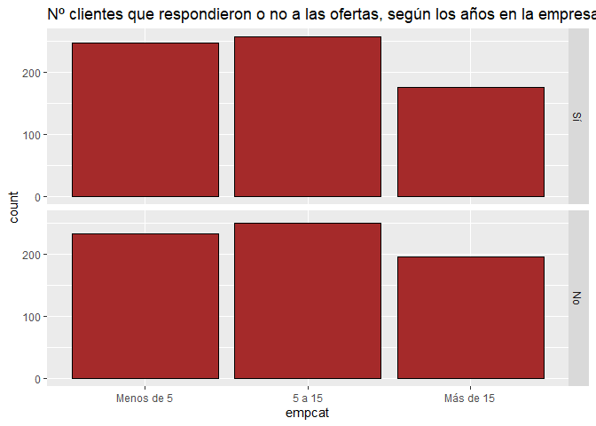<!-- -->

``` r
ggplot(datafinal.quiz, aes(x = satlab)) +
  geom_bar(colour = "black", fill = "purple") + 
  facet_grid(respuest~.) + 
  ggtitle("Nº clientes que respondieron o no a las ofertas, según su satisfacción laboral")
```

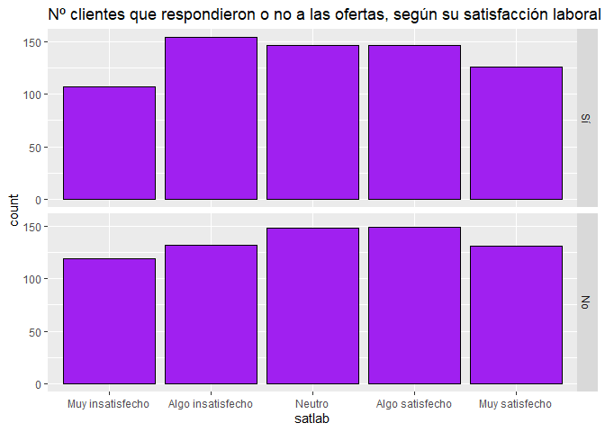<!-- -->

``` r
ggplot(datafinal.quiz, aes(x = inalam)) +
  geom_bar(colour = "black", fill = "blue") + 
  facet_grid(respuest~.) + 
  ggtitle("Nº clientes que respondieron o no a las ofertas, según si tiene  serv. inalámbrico")
```

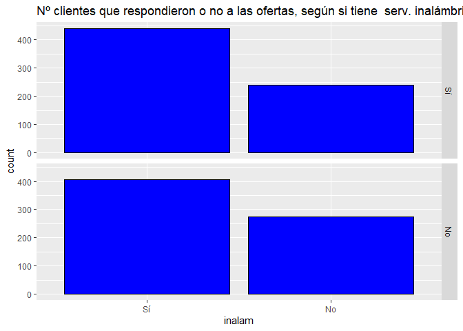<!-- -->

``` r
ggplot(datafinal.quiz, aes(x = multline)) +
  geom_bar(colour = "black", fill = "yellow") + 
  facet_grid(respuest~.) + 
  ggtitle("Nº clientes que respondieron o no a las ofertas, según si tiene  múltiples líneas")
```

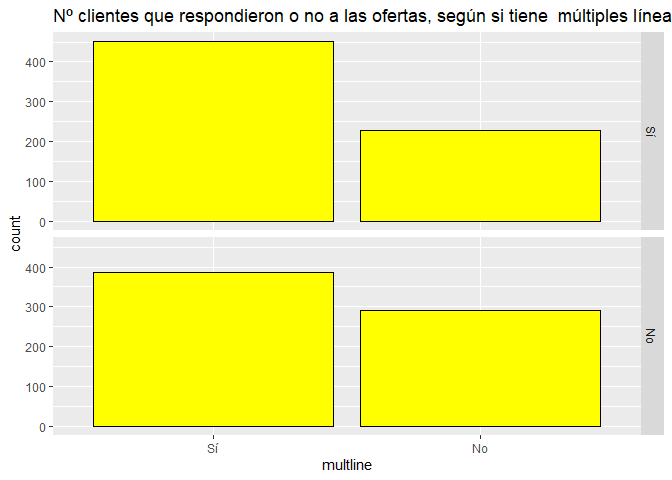<!-- -->

``` r
ggplot(datafinal.quiz, aes(x = voz)) +
  geom_bar(colour = "black", fill = "green") + 
  facet_grid(respuest~.) + 
  ggtitle("Nº clientes que respondieron o no a las ofertas, según si tiene  buzón de voz")
```

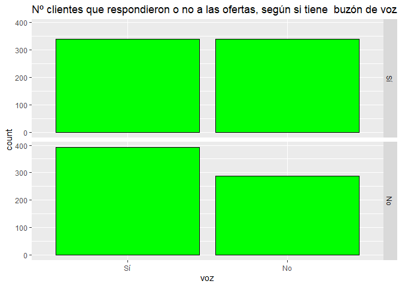<!-- -->

``` r
ggplot(datafinal.quiz, aes(x = busca)) +
  geom_bar(colour = "black", fill = "red") + 
  facet_grid(respuest~.) + 
  ggtitle("Nº clientes que respondieron o no a las ofertas, según si tiene  buscapersonas")
```

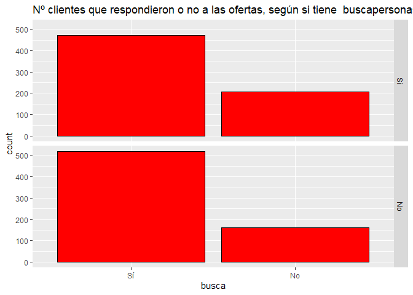<!-- -->

``` r
ggplot(datafinal.quiz, aes(x = internet)) +
  geom_bar(colour = "black", fill = "pink") + 
  facet_grid(respuest~.) + 
  ggtitle("Nº clientes que respondieron o no a las ofertas, según si tiene internet")
```

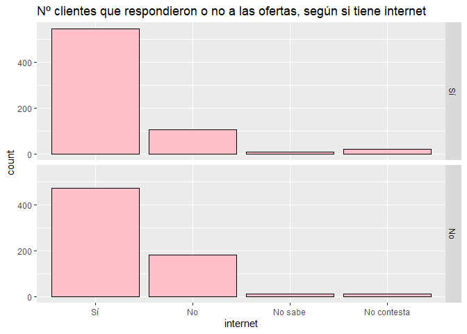<!-- -->

``` r
ggplot(datafinal.quiz, aes(x = idllam)) +
  geom_bar(colour = "black", fill = "green") + 
  facet_grid(respuest~.) + 
  ggtitle("Nº clientes que respondieron o no a las ofertas, según si tiene ID llamadas")
```

<!-- -->

``` r
ggplot(datafinal.quiz, aes(x = espera)) +
  geom_bar(colour = "black", fill = "black") + 
  facet_grid(respuest~.) + 
  ggtitle("Nº clientes que respondieron o no a las ofertas, según si tiene llamada en espera")
```

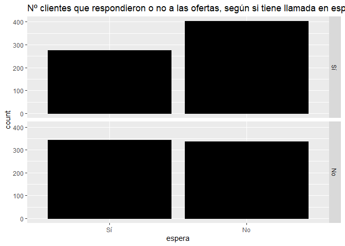<!-- -->

``` r
ggplot(datafinal.quiz, aes(x = tv)) +
  geom_bar(colour = "black", fill = "purple") + 
  facet_grid(respuest~.) + 
  ggtitle("Nº clientes que respondieron o no a las ofertas, según si tiene  televisión")
```

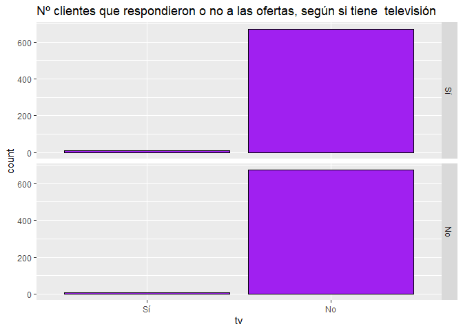<!-- -->

``` r
ggplot(datafinal.quiz, aes(x = video)) +
  geom_bar(colour = "black", fill = "lightblue") + 
  facet_grid(respuest~.) + 
  ggtitle("Nº clientes que respondieron o no a las ofertas, según si tiene  vídeo")
```

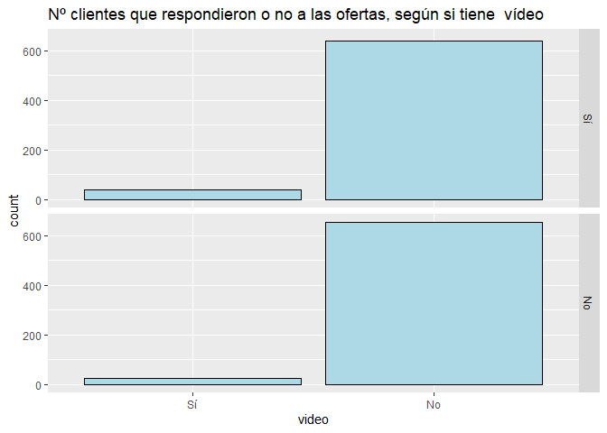<!-- -->

``` r
ggplot(datafinal.quiz, aes(x = cd)) +
  geom_bar(colour = "black", fill = "grey") + 
  facet_grid(respuest~.) + 
  ggtitle("Nº clientes que respondieron o no a las ofertas, según si tiene  Hi-fi")
```

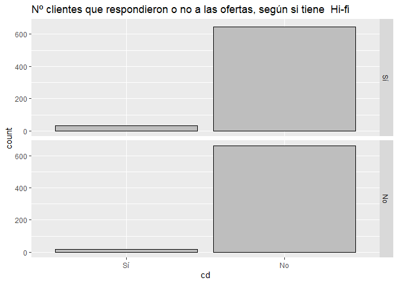<!-- -->

``` r
ggplot(datafinal.quiz, aes(x = pda)) +
  geom_bar(colour = "black", fill = "purple") + 
  facet_grid(respuest~.) + 
  ggtitle("Nº clientes que respondieron o no a las ofertas, según si tiene  PDA")
```

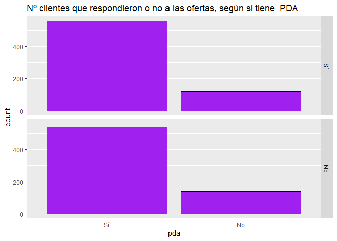<!-- -->

``` r
ggplot(datafinal.quiz, aes(x = pc)) +
  geom_bar(colour = "black", fill = "green") + 
  facet_grid(respuest~.) + 
  ggtitle("Nº clientes que respondieron o no a las ofertas, según si tiene  ordenador")
```

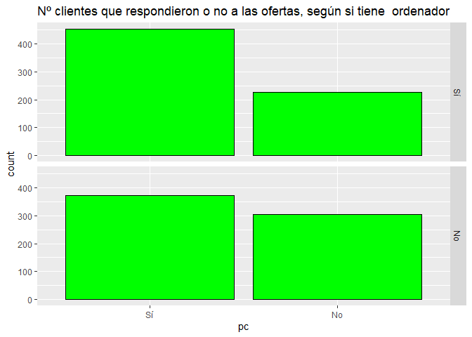<!-- -->

``` r
ggplot(datafinal.quiz, aes(x = fax)) +
  geom_bar(colour = "black", fill = "orange") + 
  facet_grid(respuest~.) + 
  ggtitle("Nº clientes que respondieron o no a las ofertas, según si tiene  fax")
```

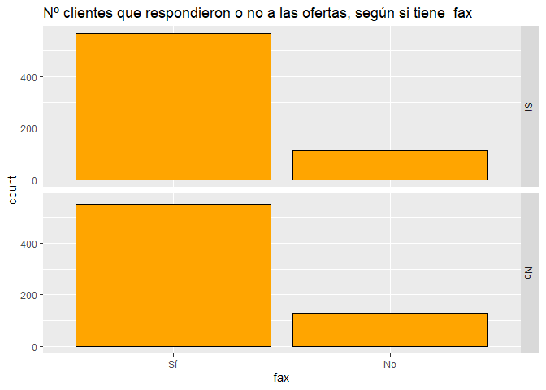<!-- -->

``` r
ggplot(datafinal.quiz, aes(x = noticias)) +
  geom_bar(colour = "black", fill = "black") + 
  facet_grid(respuest~.) + 
  ggtitle("Nº clientes que respondieron o no a las ofertas, según si está suscrito a periódico")
```

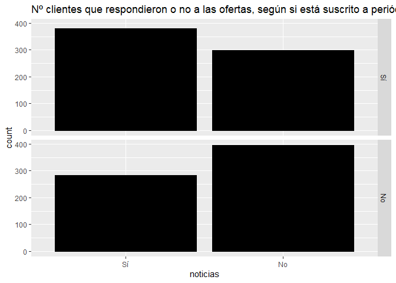<!-- -->

## Variables Explicativas Numéricas

``` r
plotar(datafinal.quiz, target = "respuest", plot_type = "boxplot") 
```

<!-- -->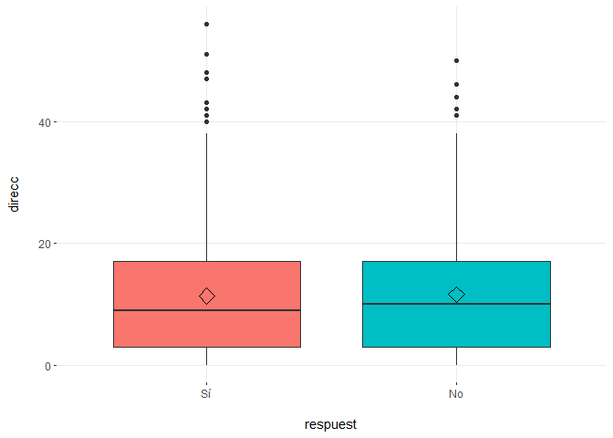<!-- -->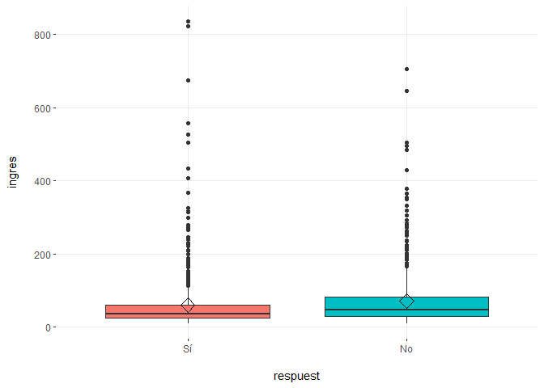<!-- -->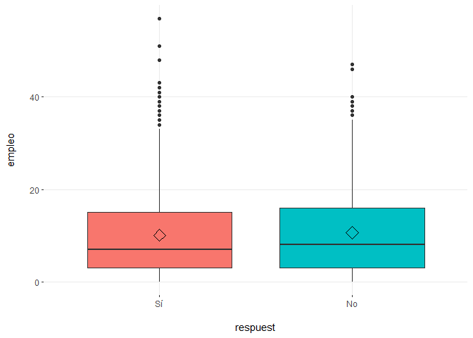<!-- -->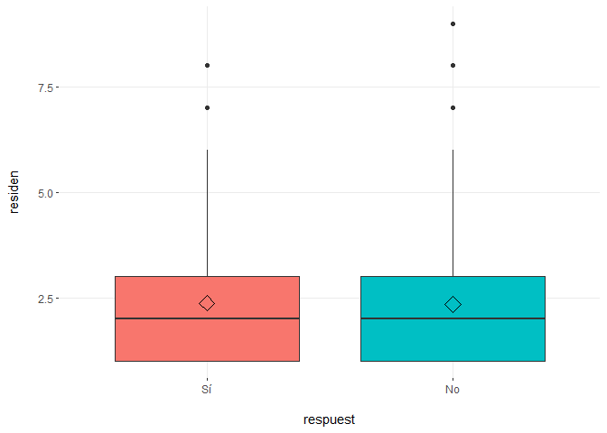<!-- -->

``` r
# Primeros registros de clientes que llevan viviendo en la misma dirección más de 40 años.
head(data.quiz[datafinal.quiz$direcc>40,])
```

    ##     edad   marital direcc ingres    ingcat coche  cochecat
    ## 18    32 Sin casar      0     28 $25 - $49  13.7 Económico
    ## 34    25    Casado      0     58 $50 - $74  28.4  Estándar
    ## 127   25 Sin casar      4     59 $50 - $74  28.4  Estándar
    ## 212   54 Sin casar     34    286      $75+  73.6      Lujo
    ## 376   37 Sin casar      7     58 $50 - $74  29.4  Estándar
    ## 396   50    Casado     29     86      $75+  42.1      Lujo
    ##                            educ empleo retirado     empcat            satlab
    ## 18  No completó el bachillerato      2       No Menos de 5   Algo satisfecho
    ## 34     Universitarios parciales      4       No Menos de 5 Algo insatisfecho
    ## 127              Universitarios      2       No Menos de 5 Algo insatisfecho
    ## 212              Universitarios     23       No  Más de 15            Neutro
    ## 376                Bachillerato     10       No     5 a 15 Algo insatisfecho
    ## 396    Universitarios parciales     14       No     5 a 15   Algo satisfecho
    ##     genero residen inalam multline voz busca internet idllam espera tv video cd
    ## 18   Mujer       2     Sí       Sí  Sí    Sí       Sí     No     No No    No No
    ## 34   Mujer       5     No       No  No    Sí       Sí     No     No No    No No
    ## 127  Mujer       1     No       Sí  Sí    Sí       No     No     No No    No No
    ## 212 Hombre       1     Sí       Sí  No    No       No     Sí     Sí No    No No
    ## 376 Hombre       2     Sí       Sí  Sí    Sí       No     Sí     No No    No No
    ## 396 Hombre       2     Sí       No  No    Sí       Sí     Sí     Sí No    No No
    ##     pda pc fax noticias respuest
    ## 18   No Sí  No       No       No
    ## 34   No No  Sí       No       No
    ## 127  Sí No  Sí       Sí       No
    ## 212  Sí No  Sí       Sí       No
    ## 376  Sí Sí  Sí       Sí       No
    ## 396  Sí Sí  Sí       Sí       No

Comentarios//: Lógicamente, los clientes más mayores (60 años) han
vivido en el mismo hogar más de 40 años.

``` r
# Primeros registros de clientes que tienen unos ingresos menos de 10.000 euros.
head(data.quiz[datafinal.quiz$ingres<10, ])
```

    ##      edad   marital direcc ingres    ingcat coche cochecat
    ## 127    25 Sin casar      4     59 $50 - $74  28.4 Estándar
    ## 412    41    Casado     18    152      $75+  75.7     Lujo
    ## 846    29 Sin casar      1     31 $25 - $49  15.2 Estándar
    ## 887    42    Casado      5     61 $50 - $74  31.2     Lujo
    ## 937    54    Casado     23    125      $75+  62.5     Lujo
    ## 1020   38 Sin casar     15     70 $50 - $74  34.0     Lujo
    ##                             educ empleo retirado     empcat            satlab
    ## 127               Universitarios      2       No Menos de 5 Algo insatisfecho
    ## 412  No completó el bachillerato     22       No  Más de 15 Algo insatisfecho
    ## 846                 Bachillerato      5       No     5 a 15  Muy insatisfecho
    ## 887                 Bachillerato      9       No     5 a 15  Muy insatisfecho
    ## 937  No completó el bachillerato     34       No  Más de 15   Algo satisfecho
    ## 1020    Universitarios parciales      7       No     5 a 15    Muy satisfecho
    ##      genero residen inalam multline voz busca internet idllam espera tv video
    ## 127   Mujer       1     No       Sí  Sí    Sí       No     No     No No    No
    ## 412   Mujer       4     No       No  Sí    Sí       No     No     No No    No
    ## 846  Hombre       1     No       Sí  Sí    Sí       Sí     No     No No    No
    ## 887   Mujer       2     Sí       Sí  Sí    Sí       Sí     Sí     No No    No
    ## 937  Hombre       2     Sí       Sí  No    No       Sí     Sí     Sí No    No
    ## 1020  Mujer       3     Sí       No  No    Sí       Sí     No     No No    No
    ##      cd pda pc fax noticias respuest
    ## 127  No  Sí No  Sí       Sí       No
    ## 412  No  No Sí  Sí       No       No
    ## 846  No  No No  No       Sí       No
    ## 887  No  Sí Sí  Sí       No       No
    ## 937  No  Sí Sí  Sí       Sí       No
    ## 1020 No  Sí No  Sí       No       Sí

Comentarios//: Los ingresos más bajos se encontraron en clientes mayores
de 60 años, retirados y que, en su mayoría, no respondieron a las
ofertas mensuales.

# Selección de Variables

Las variables son seleccionadas mediante la eliminación de manera
recursiva mediante un random forest. Primeramente, se escalan y
normalizan los datos, ya que las variables de estudio no están en el
mismo rango y ello podría influir en las predicciones.

``` r
val.normalizar <- preProcess(as.data.frame(datafinal.quiz), 
                             method = c("center", "scale"))

normaliz.quiz <- predict(val.normalizar, as.data.frame(datafinal.quiz))
summary(normaliz.quiz)
```

    ##       edad              marital        direcc            ingres        
    ##  Min.   :-1.9464   Sin casar:673   Min.   :-1.1519   Min.   :-0.72025  
    ##  1st Qu.:-0.7453   Casado   :685   1st Qu.:-0.8509   1st Qu.:-0.51220  
    ##  Median :-0.1047                   Median :-0.2488   Median :-0.32335  
    ##  Mean   : 0.0000                   Mean   : 0.0000   Mean   : 0.00000  
    ##  3rd Qu.: 0.7762                   3rd Qu.: 0.5540   3rd Qu.: 0.07356  
    ##  Max.   : 2.6980                   Max.   : 4.4676   Max.   : 9.88098  
    ##           ingcat         cochecat                            educ    
    ##  Menos de $25:304   Económico:449   No completó el bachillerato:345  
    ##  $25 - $49   :523   Estándar :488   Bachillerato               :415  
    ##  $50 - $74   :208   Lujo     :421   Universitarios parciales   :285  
    ##  $75+        :323                   Universitarios             :252  
    ##                                     Post-universitarios        : 61  
    ##                                                                      
    ##      empleo        retirado         empcat                  satlab   
    ##  Min.   :-1.0695   No:1272   Menos de 5:480   Muy insatisfecho :226  
    ##  1st Qu.:-0.7604   Sí:  86   5 a 15    :507   Algo insatisfecho:286  
    ##  Median :-0.2452             Más de 15 :371   Neutro           :294  
    ##  Mean   : 0.0000                              Algo satisfecho  :295  
    ##  3rd Qu.: 0.4760                              Muy satisfecho   :257  
    ##  Max.   : 4.8034                                                     
    ##     genero       residen        inalam   multline voz      busca   
    ##  Hombre:698   Min.   :-0.9220   Sí:845   Sí:838   Sí:731   Sí:989  
    ##  Mujer :660   1st Qu.:-0.9220   No:513   No:520   No:627   No:369  
    ##               Median :-0.2441                                      
    ##               Mean   : 0.0000                                      
    ##               3rd Qu.: 0.4338                                      
    ##               Max.   : 4.5012                                      
    ##         internet    idllam   espera    tv       video      cd       pda      
    ##  Sí         :1015   Sí:629   Sí:619   Sí:  16   Sí:  65   Sí:  52   Sí:1097  
    ##  No         : 288   No:729   No:739   No:1342   No:1293   No:1306   No: 261  
    ##  No sabe    :  21                                                            
    ##  No contesta:  34                                                            
    ##                                                                              
    ##                                                                              
    ##   pc      fax       noticias respuest
    ##  Sí:826   Sí:1116   Sí:664   Sí:679  
    ##  No:532   No: 242   No:694   No:679  
    ##                                      
    ##                                      
    ##                                      
    ## 

``` r
# Variables explicativas.
x <- normaliz.quiz %>% select(-respuest) %>%
  as.data.frame()

# variable objetivo.
y <- normaliz.quiz$respuest

# Dividir el dataset en: train (80%) y test (20%).
set.seed(123)
inTrain <- createDataPartition(y, p = .80, list = FALSE)[,1]

x.train <- x[inTrain,]
x.test <- x[-inTrain,]
y.train <- y[inTrain]
y.test <- y[-inTrain]

registerDoParallel(cores = 4)
# Definir el control usando la función de selección de random forest.
control <- rfeControl(functions = rfFuncs,
                      method = "cv",
                      number = 4)
# Definir la semilla para la reproductividad de los resultados.
set.seed(123)
# Ejecutar el algoritmo RFE.
rfe.quiz <- rfe(x.train,
                y.train,
                sizes = c(2:27),
                rfeControl = control)

rfe.quiz
```

    ## 
    ## Recursive feature selection
    ## 
    ## Outer resampling method: Cross-Validated (4 fold) 
    ## 
    ## Resampling performance over subset size:
    ## 
    ##  Variables Accuracy   Kappa AccuracySD KappaSD Selected
    ##          2   0.5469 0.09375    0.02962 0.05924         
    ##          3   0.5561 0.11213    0.03801 0.07603         
    ##          4   0.5358 0.07169    0.04721 0.09443         
    ##          5   0.5469 0.09375    0.03632 0.07264         
    ##          6   0.5515 0.10294    0.02565 0.05130         
    ##          7   0.5653 0.13051    0.03941 0.07882        *
    ##          8   0.5607 0.12132    0.02918 0.05836         
    ##          9   0.5496 0.09926    0.02175 0.04350         
    ##         10   0.5515 0.10294    0.01968 0.03937         
    ##         11   0.5460 0.09191    0.03240 0.06480         
    ##         12   0.5469 0.09375    0.01654 0.03309         
    ##         13   0.5450 0.09007    0.02000 0.03999         
    ##         14   0.5414 0.08272    0.01977 0.03954         
    ##         15   0.5561 0.11213    0.01954 0.03908         
    ##         16   0.5542 0.10846    0.01482 0.02964         
    ##         17   0.5551 0.11029    0.04083 0.08166         
    ##         18   0.5441 0.08824    0.04381 0.08762         
    ##         19   0.5524 0.10478    0.04364 0.08729         
    ##         20   0.5487 0.09743    0.03907 0.07813         
    ##         21   0.5506 0.10110    0.03644 0.07288         
    ##         22   0.5616 0.12316    0.02554 0.05108         
    ##         23   0.5515 0.10294    0.03076 0.06152         
    ##         24   0.5496 0.09926    0.02643 0.05285         
    ##         25   0.5579 0.11581    0.03139 0.06279         
    ##         26   0.5579 0.11581    0.02640 0.05281         
    ##         27   0.5607 0.12132    0.02792 0.05584         
    ## 
    ## The top 5 variables (out of 7):
    ##    noticias, internet, ingres, voz, video

Comentarios//: El random forest ha señalado que hay 8 variables
destacando sobre el resto y que serán las elegidas para el modelado.
Este modelo al compilar repetidas veces se ha obtenido entre 8-10
variables. Se optó por elegir las variables señaladas por el modelo la
primera vez que se ejecutó (los resultados no fueron visualizados para
que el lector no se liase).

# Selección del dataset final

``` r
dataprep.quiz <- datafinal.quiz[,c(4,6,7,16,18,23,25,27,28)]
head(dataprep.quiz)
```

    ##    ingres  cochecat                        educ voz internet cd pc noticias
    ## 6      76      Lujo    Universitarios parciales  No       Sí No No       Sí
    ## 13     40  Estándar              Universitarios  Sí       Sí Sí Sí       No
    ## 18     28 Económico No completó el bachillerato  Sí       Sí No Sí       No
    ## 29    272      Lujo No completó el bachillerato  No       Sí No Sí       Sí
    ## 34     58  Estándar    Universitarios parciales  No       Sí No No       No
    ## 43     32  Estándar                Bachillerato  Sí       Sí No Sí       No
    ##    respuest
    ## 6        No
    ## 13       No
    ## 18       No
    ## 29       No
    ## 34       No
    ## 43       No

# Estadística Descriptiva Univariante

## Variable Numérica

``` r
profiling_num(dataprep.quiz)
```

    ##   variable     mean  std_dev variation_coef p_01 p_05  p_25 p_50 p_75   p_95
    ## 1   ingres 65.25479 78.10412        1.19691   10   16 25.25   40   71 200.15
    ##     p_99 skewness kurtosis   iqr               range_98    range_80
    ## 1 390.61 4.340598 30.26531 45.75 [10, 390.610000000002] [19, 133.3]

``` r
plot_num(dataprep.quiz)
```

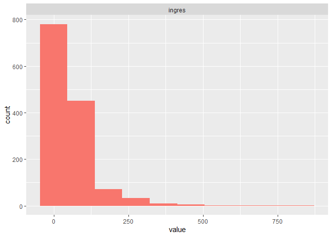<!-- -->

## Variables Categóricas

``` r
freq(dataprep.quiz)
```

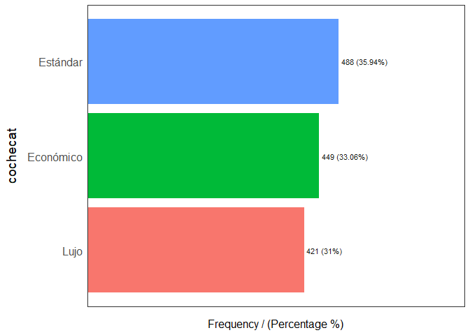<!-- -->

    ##    cochecat frequency percentage cumulative_perc
    ## 1  Estándar       488      35.94           35.94
    ## 2 Económico       449      33.06           69.00
    ## 3      Lujo       421      31.00          100.00

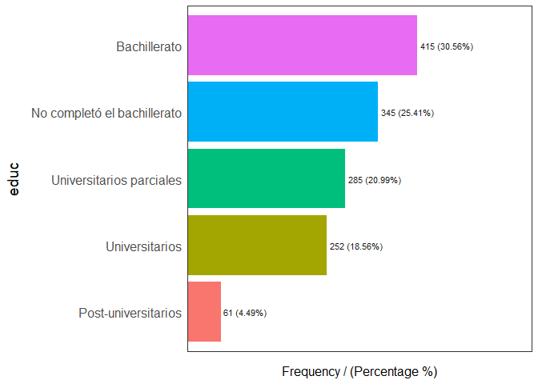<!-- -->

    ##                          educ frequency percentage cumulative_perc
    ## 1                Bachillerato       415      30.56           30.56
    ## 2 No completó el bachillerato       345      25.41           55.97
    ## 3    Universitarios parciales       285      20.99           76.96
    ## 4              Universitarios       252      18.56           95.52
    ## 5         Post-universitarios        61       4.49          100.00

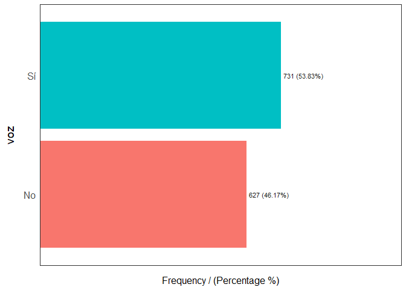<!-- -->

    ##   voz frequency percentage cumulative_perc
    ## 1  Sí       731      53.83           53.83
    ## 2  No       627      46.17          100.00

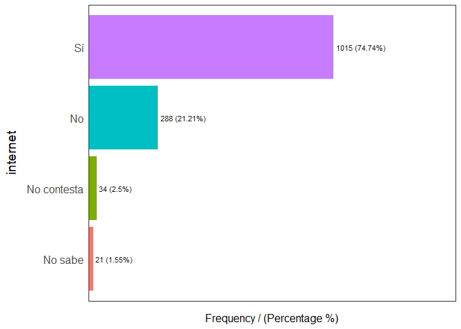<!-- -->

    ##      internet frequency percentage cumulative_perc
    ## 1          Sí      1015      74.74           74.74
    ## 2          No       288      21.21           95.95
    ## 3 No contesta        34       2.50           98.45
    ## 4     No sabe        21       1.55          100.00

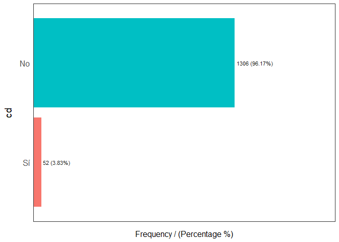<!-- -->

    ##   cd frequency percentage cumulative_perc
    ## 1 No      1306      96.17           96.17
    ## 2 Sí        52       3.83          100.00

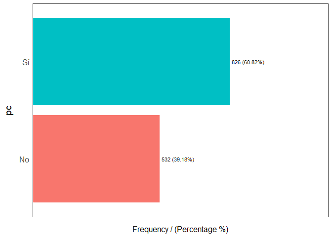<!-- -->

    ##   pc frequency percentage cumulative_perc
    ## 1 Sí       826      60.82           60.82
    ## 2 No       532      39.18          100.00

<!-- -->

    ##   noticias frequency percentage cumulative_perc
    ## 1       No       694       51.1            51.1
    ## 2       Sí       664       48.9           100.0

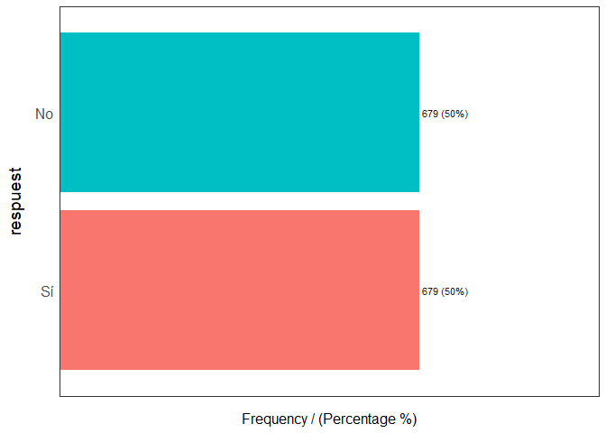<!-- -->

    ##   respuest frequency percentage cumulative_perc
    ## 1       Sí       679         50              50
    ## 2       No       679         50             100

    ## [1] "Variables processed: cochecat, educ, voz, internet, cd, pc, noticias, respuest"

# Guardar el archivo de datos preprocesado

``` r
saveRDS(dataprep.quiz, "dataprep.quiz.rds")
```
